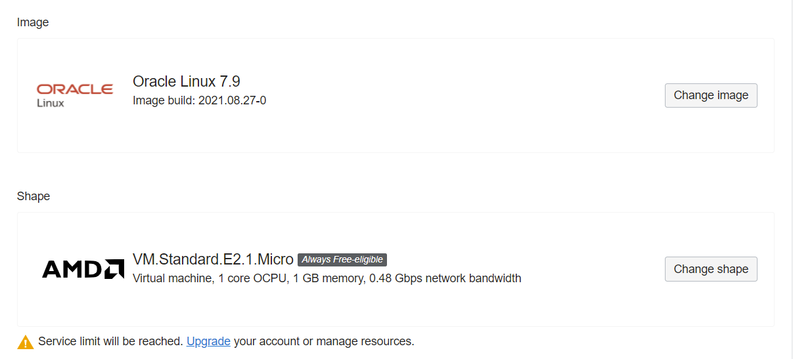
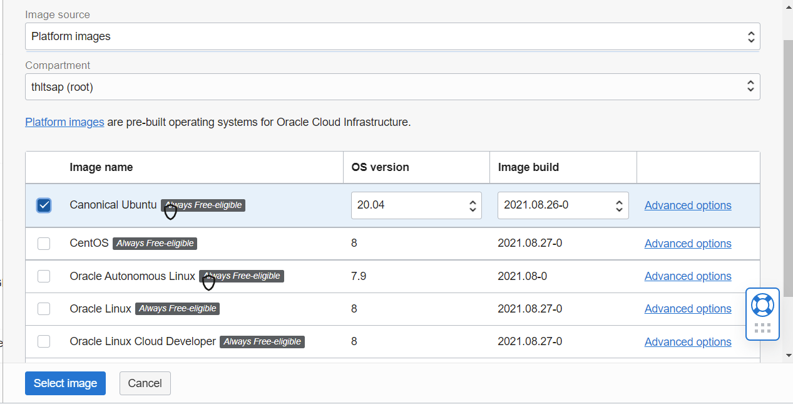

# 03 - Virtual Machine

## Tujuan Pembelajaran

1. Mengetahui layanan Oracle Cloud Infrastructure Compute.
2. Mampu membuat Virtual Machine (VM) di layanan compute Oracle Cloud.

## Hasil Praktikum

Berikut ini adalah bukti telah membuat Virual Machine di layanan compute Oracle Cloud.

## Praktikum Membuat VM (Virtual Machine)

### Langkah 1
Setelah berhasil login dan ada di beranda Oracle Cloud akun Anda, silakan pilih menu di
pojok kiri atas, lalu pilih menu Compute > Instances.

### Langkah 2
Pilih Create instance untuk membuat VM baru. Pada gambar berikut akan tampil nama,
status, dll terkait VM yang pernah kita buat. Jika belum ada, berarti VM belum pernah dibuat.

### Langkah 3
Kita beri nama VM sesuai dengan keinginan. Misalnya di sini vm-ubuntu. Untuk
compartment biarkan secara default dan placement pastikan Always Free-eligible. 

### Langkah 4
Pada bagian Image and shape silakan atur sistem operasi yang akan kita gunakan, ubah
menjadi Ubuntu dengan cara klik Edit. Untuk bagian shape biarkan saja, secara default biasanya
menggunakan AMD VM.Standard.E2.1.Micro Always Free-eligible dengan 1 core CPU dan 1 GB
RAM.

Lakukan perubahan sistem operasi dengan klik Change image.

Pilih Canonical Ubuntu versi 20.04, lalu klik Select image.

### Langkah 5
Pada bagian Networking biarkan saja pengaturannya. VCN akan dibahas lebih lanjut pada
pertemuan berikutnya. Secara default, akses SSH port 21 sudah bisa diakses.

Selanjutnya bagian SSH keys, kita perlu klik Save Private Key untuk mengunduh private key milik
kita agar nanti VM bisa diakses.

### Langkah 6
Untuk kapasitas disk bisa kita atur sesuai kebutuhan, namun di sini biarkan secara default
seperti pada gambar berikut, yaitu disk bervolume 46.6 GB. Langkah terakhir klik Create di pojok
kiri bawah untuk memulai membuat VM.

## Tugas 

### Langkah - langkah menghubungkan SSH ke VM (Virtual Machine)

### Langkah 1
Buka Aplikasi Putty gen pilih conversions lalu pilih import key dan pilih private key yang sudah disimpan sebelumnya, untuk convert format private key yang anda telah simpan pada saat membuat VM.

### Langkah 2
Pilih Save Private key, lalu simpanlah private key tersebut .

### Langkah 3
Buka Aplikasi Putty, Lalu masukkan Host Name (IP address), IP address public dapat di temukan VM yang anda telah buat. 

### Langkah 4
Lalu pilih pada bagian menu SSH lalu menu Auth, kemudian Browse pilih file private key yang telah anda convert dan yang telah disimpan.

### Langkah 5
Akan tampil hasil seperti ini, dan ketikkan pada login as nama username(dapat diliat pada VM yang anda buat), Lalu tekan enter. 

### Langkah 6
Setelah di enter akan keluar seperti ini. Jika sudah seperti ini maka SSH sudah terhubung dengan VM.

