# 05 - Platform as a Service (PaaS)

## Tujuan Pembelajaran

1. Mengetahui layanan yang ditawarkan cloud computing khususnya Oracle Cloud 
Infrastructure (OCI).

##  Praktikum 1: Praktikum PaaS

### Langkah 1
 Silakan login ke akun Oracle Cloud Anda masing-masing melalui tautan ini
 https://www.oracle.com/cloud/sign-in.html

 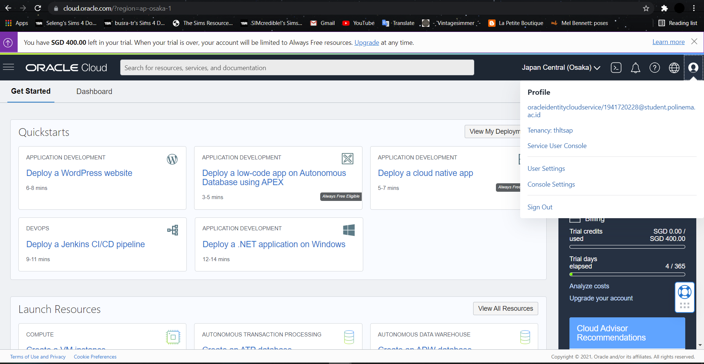

### Langkah 2
 Setelah berhasil login dan ada di beranda Oracle Cloud akun Anda, silakan pilih
menu di pojok kiri atas, lalu pilih menu Databse > MySQL

 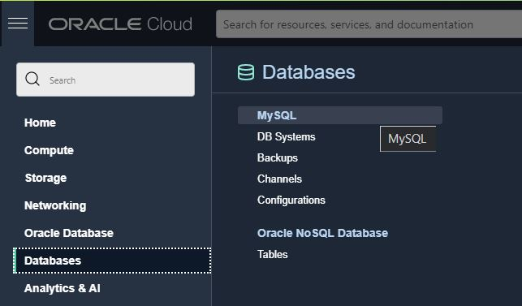

### Langkah 3
Pada halaman ini klik Create MySQL DB Systems

 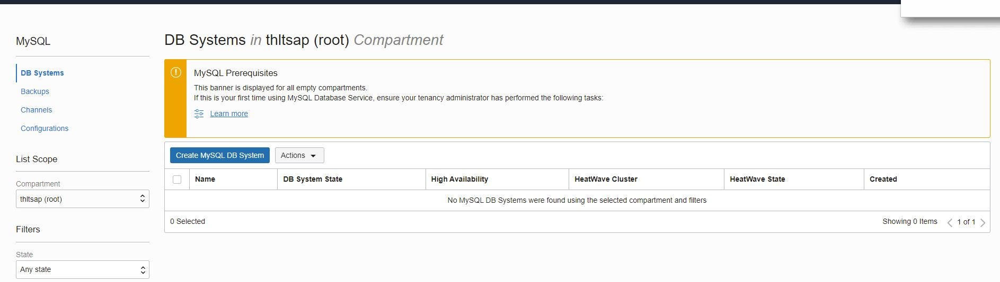

### Langkah 4
Pada bagian Provide DB System information dapat dilihat seperti gambar dibawah:

 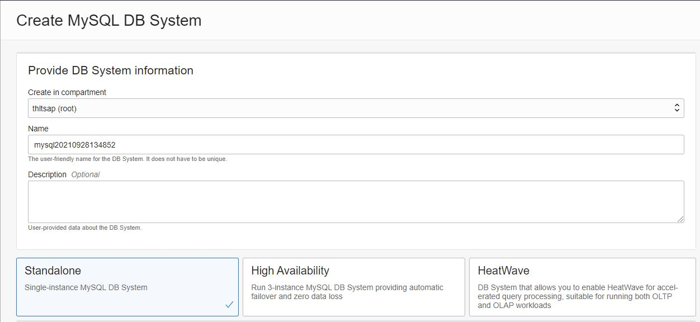 

### Langkah 5
Pada bagian Create Administartor credentials isilah Username dan password yang anda inginkan

 

### Langkah 6
Pada bagian Configure networking dapat dilihat seperti gambar dibawah:

 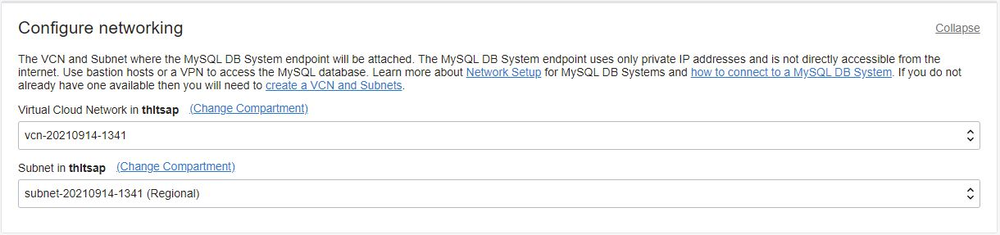

### Langkah 7
Pada bagian Configure placement dapat dilihat seperti gambar dibawah:

 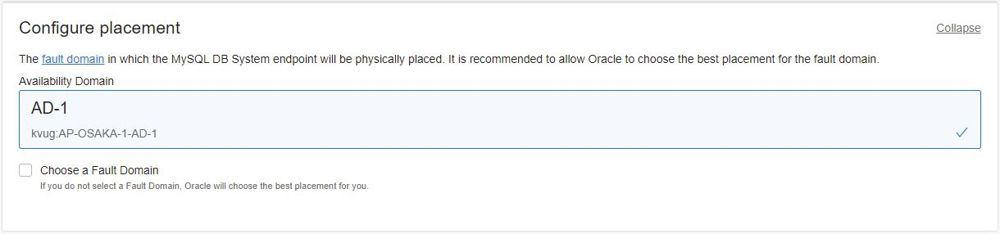  

### Langkah 8
Pada bagian ini Configure hardware Data Storage Size (GB) diisi 50.

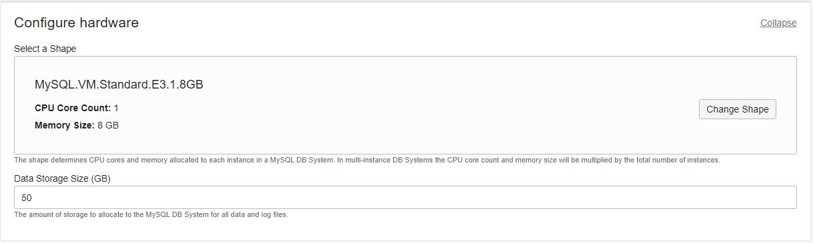

### Langkah 9
Pada bagian Configure Backup Plan lakukan seperti gambar dibawah ini. Lalu klik Create.

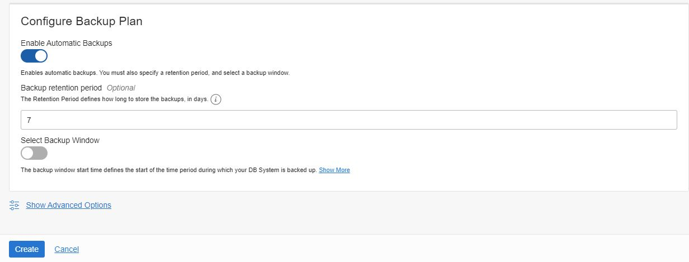

### Langkah 10
Tunggulah Database System hingga status Active.

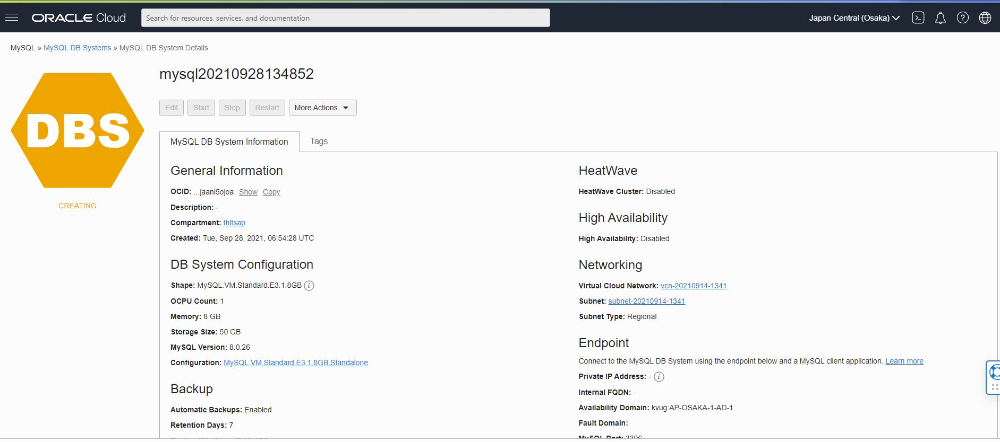

### Langkah 11
Jika Database System udah Active akan bewarna hijau seperti gambar dibawah ini:

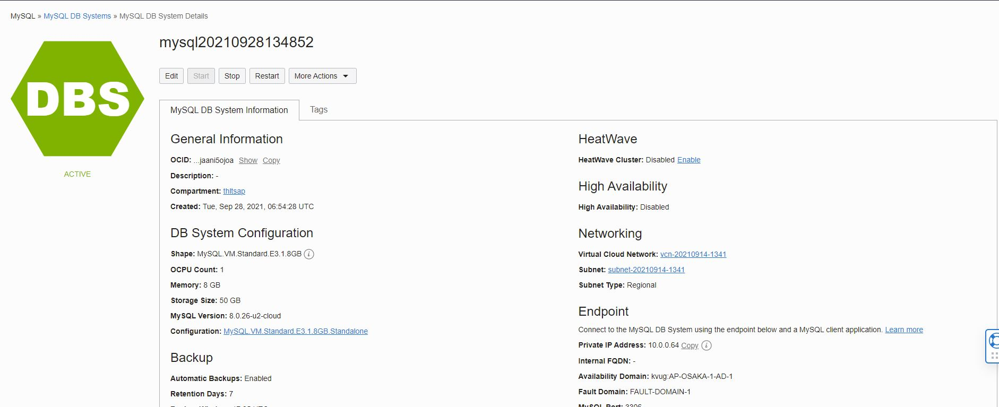

### Langkah 12
Silakan pilih menu di pojok kiri atas, lalu pilih menu Networking > Virtual Cloud Networks

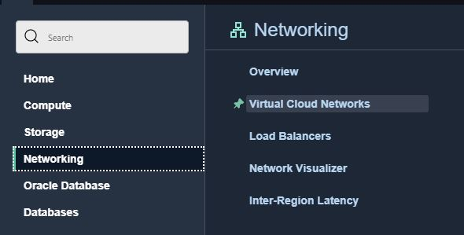

### Langkah 13
Pada bagian ini klik Name Virtual Cloud Networks

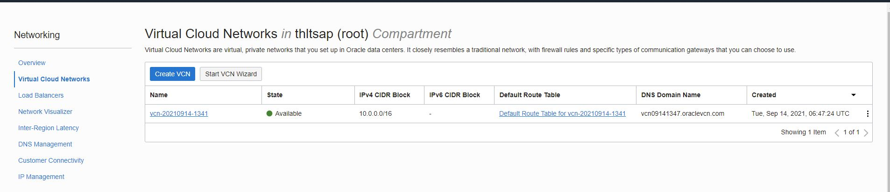

### Langkah 14
Klik pada menu Security Lists

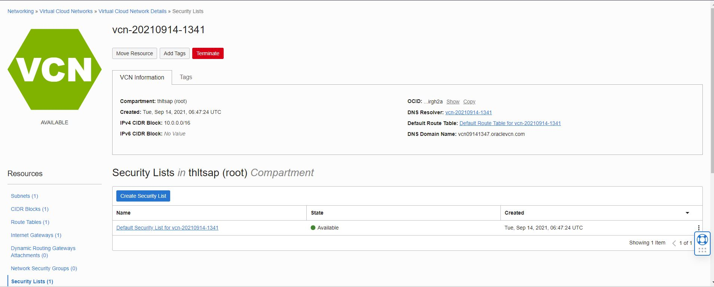

### Langkah 15
Klik pada button Add Ingress Rules

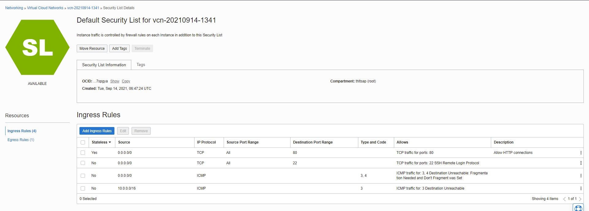

### Langkah 16
Pada bagian Add Ingress Rules isilah Source CIDR dengan 0.0.0.0/0, selanjutnya pada bagian Destination Port Range isilah 3306,33060. Lalu klik button Add Ingress Rules

### Langkah 17
Masukkan ke VCN anda menggunakan PuttY dan ketikkan mysql jika output seperti dibawah ini maka kita harus instalasi mysql terlebih dahulu.

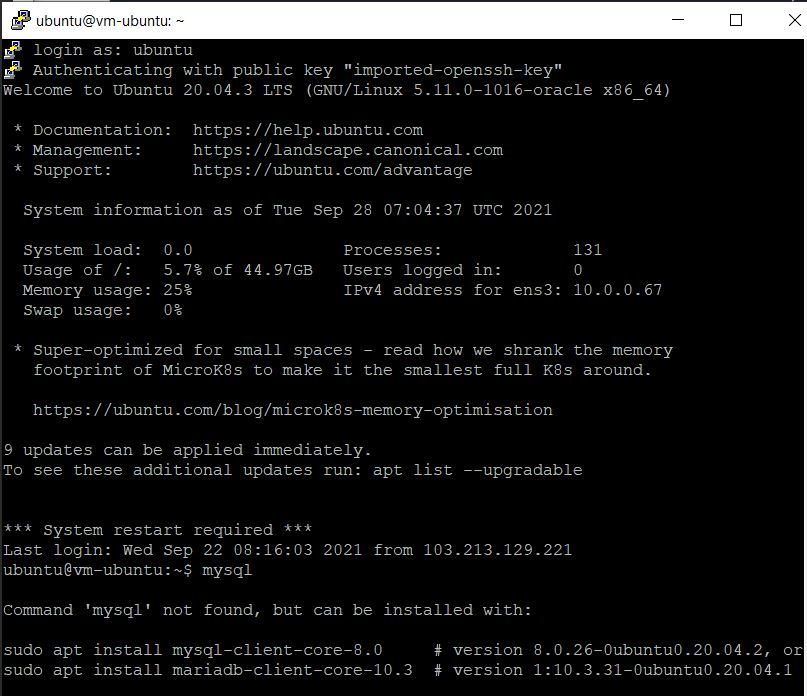

### Langkah 18
Untuk melakukan instalasi mysql dapat mengetikkan code sperti berikut:

sudo apt install mysql-client-core-8.0

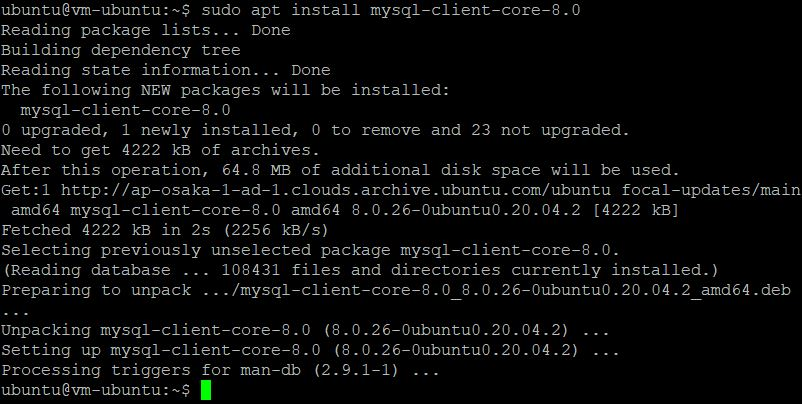

### Langkah 19
Lakukan penghubungan VCN dengan Database system yang telah dibuat pada praktikum diatas dengan mengetikkan code seperti ini

mysql -u admin -p -h IpPrivate pada Database System

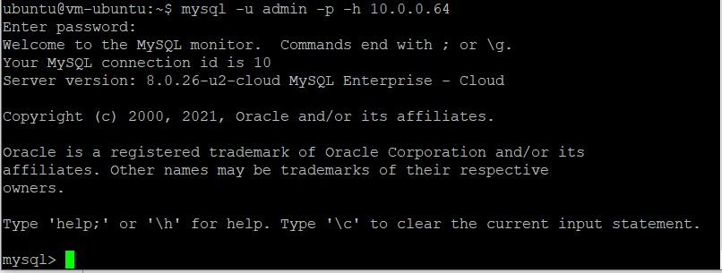

Jika tampilan seperti output ini maka berhasil terhubung.

## Tugas
Cari aplikasi php yang memiliki database kemudian upload ke server dan buat databasenya.

### Langkah 1
Akses instance dengan PuttY

 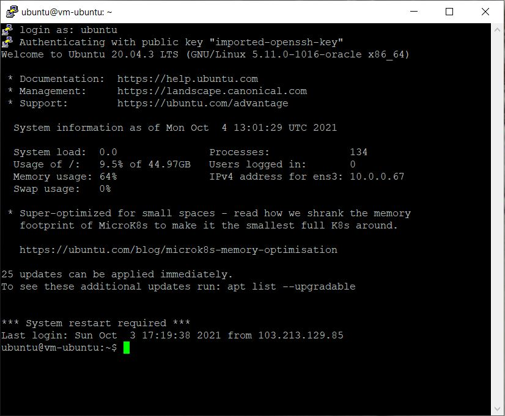

 ### Langkah 2
Lakukan update seperti berikut

sudo apt update

 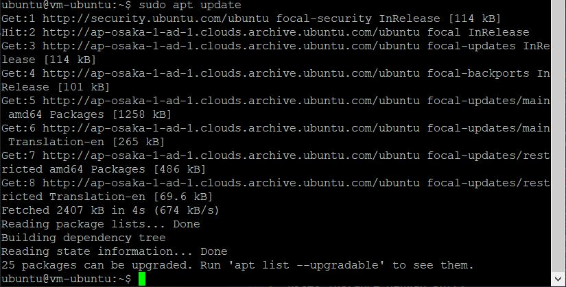

### Langkah 3
Lakukan Install proftpd seperti berikut

sudo apt install proftpd

 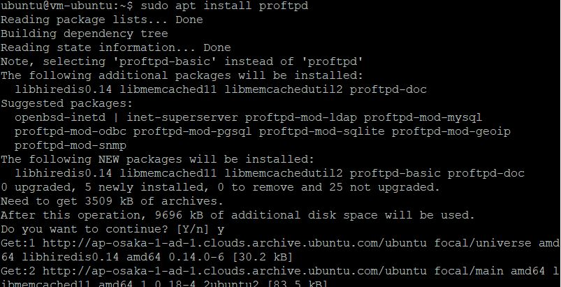

### Langkah 4
Lakukan Install phpmyadmin seperti berikut

sudo apt install phpmyadmin

 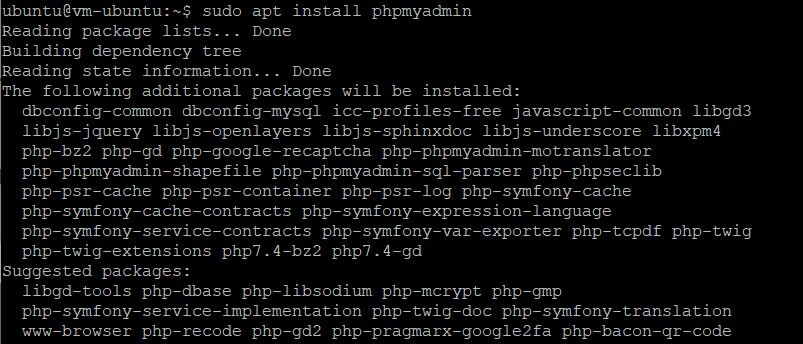  

Nanti akan ada tampilan pilihlah apache2 lalu tekan tab setelah itu enter. pada Pop up selanjutnya pilih lah yang NO. 

### Langkah 5
Lakukan seperti berikut

sudo chmod 777 -R /var/www

 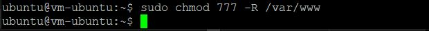

### Langkah 6
Lakukan mengakses mysql untuk membuat database seperti berikut

mysql -u admin -p -h 10.0.0.64

 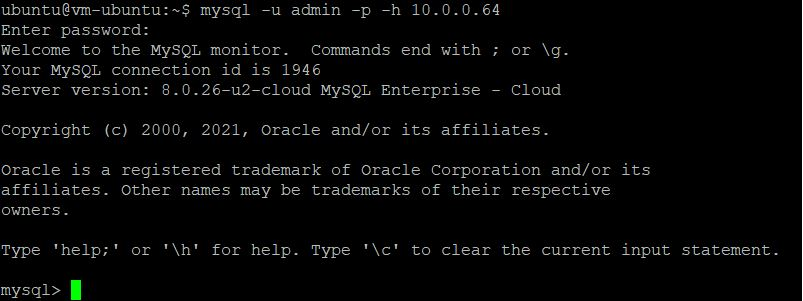

 ### Langkah 7
Membuat Database seperti berikut

CREATE DATABASE nomads;

 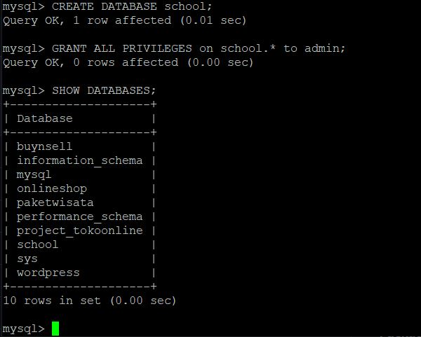 

### Langkah 8
Clone repository project ke direktori /var/www/html seperti berikut

 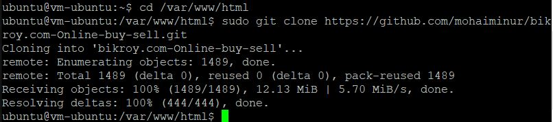

### Langkah 9
Lakukan Use database pada mysql dan Import Database nomads.sql seperti berikut:

source /var/www/html/nomads/nomads.sql

 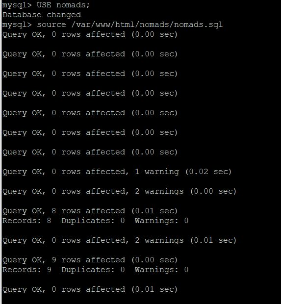

Pastikan database telah berhasil diimport

### Langkah 10
Clone repository project ke direktori /var/www/html seperti berikut

 

