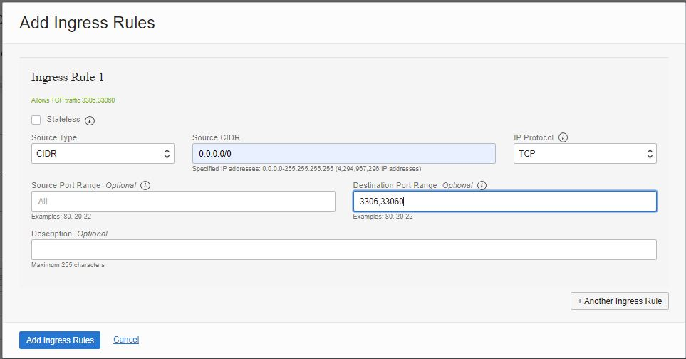

# 05 - Platform as a Service (PaaS)

## Tujuan Pembelajaran

1. Mengetahui layanan yang ditawarkan cloud computing khususnya Oracle Cloud 
Infrastructure (OCI).

##  Praktikum 1: Praktikum PaaS

### Langkah 1
 Silakan login ke akun Oracle Cloud Anda masing-masing melalui tautan ini
 https://www.oracle.com/cloud/sign-in.html

 

### Langkah 2
 Setelah berhasil login dan ada di beranda Oracle Cloud akun Anda, silakan pilih
menu di pojok kiri atas, lalu pilih menu Databse > MySQL

 

### Langkah 3
Pada halaman ini klik Create MySQL DB Systems

 

### Langkah 4
Pada bagian Provide DB System information dapat dilihat seperti gambar dibawah:

  

### Langkah 5
Pada bagian Create Administartor credentials isilah Username dan password yang anda inginkan

 

### Langkah 6
Pada bagian Configure networking dapat dilihat seperti gambar dibawah:

 

### Langkah 7
Pada bagian Configure placement dapat dilihat seperti gambar dibawah:

   

### Langkah 8
Pada bagian ini Configure hardware Data Storage Size (GB) diisi 50.

### Langkah 9
Pada bagian Configure Backup Plan lakukan seperti gambar dibawah ini. Lalu klik Create.

### Langkah 10
Tunggulah Database System hingga status Active.

### Langkah 11
Jika Database System udah Active akan bewarna hijau seperti gambar dibawah ini:

### Langkah 12
Silakan pilih menu di pojok kiri atas, lalu pilih menu Networking > Virtual Cloud Networks

### Langkah 13
Pada bagian ini klik Name Virtual Cloud Networks

### Langkah 14
Klik pada menu Security Lists

### Langkah 15
Klik pada button Add Ingress Rules

### Langkah 16
Pada bagian Add Ingress Rules isilah Source CIDR dengan 0.0.0.0/0, selanjutnya pada bagian Destination Port Range isilah 3306,33060. Lalu klik button Add Ingress Rules

### Langkah 17
Masukkan ke VCN anda menggunakan PuttY dan ketikkan mysql jika output seperti dibawah ini maka kita harus instalasi mysql terlebih dahulu.

### Langkah 18
Untuk melakukan instalasi mysql dapat mengetikkan code sperti berikut:

sudo apt install mysql-client-core-8.0

### Langkah 19
Lakukan penghubungan VCN dengan Database system yang telah dibuat pada praktikum diatas dengan mengetikkan code seperti ini

mysql -u admin -p -h IpPrivate pada Database System

Jika tampilan seperti output ini maka berhasil terhubung.

