# 05 - Platform as a Service (PaaS)

## Tujuan Pembelajaran

1. Mengetahui layanan yang ditawarkan cloud computing khususnya Oracle Cloud 
Infrastructure (OCI).

##  Praktikum 1: Praktikum PaaS

### Langkah 1
 Silakan login ke akun Oracle Cloud Anda masing-masing melalui tautan ini
 https://www.oracle.com/cloud/sign-in.html

 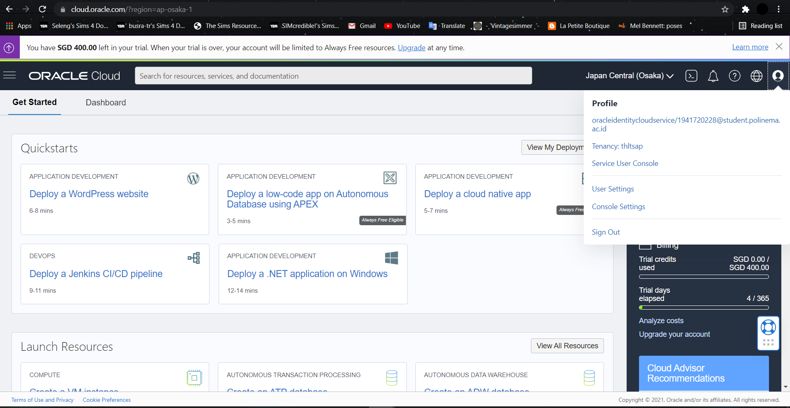

### Langkah 2
 Setelah berhasil login dan ada di beranda Oracle Cloud akun Anda, silakan pilih
menu di pojok kiri atas, lalu pilih menu Databse > MySQL

 

### Langkah 3
Pada halaman ini klik Create MySQL DB Systems

 

### Langkah 4
Pada bagian Provide DB System information dapat dilihat seperti gambar dibawah:

 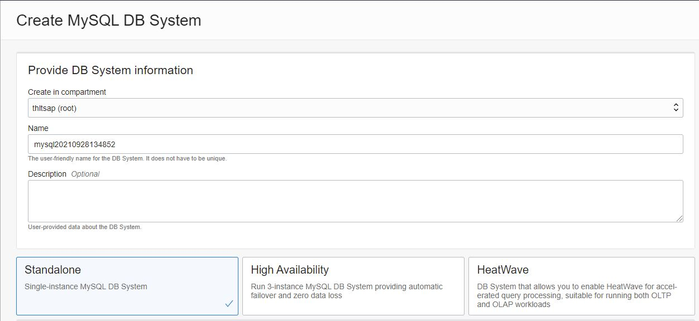 

### Langkah 5
Pada bagian Create Administartor credentials isilah Username dan password yang anda inginkan

 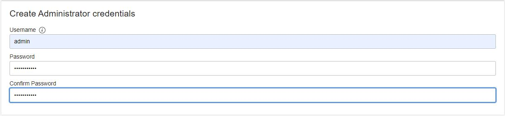

### Langkah 6
Pada bagian Configure networking dapat dilihat seperti gambar dibawah:

 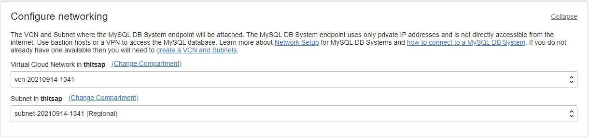

### Langkah 7
Pada bagian Configure placement dapat dilihat seperti gambar dibawah:

 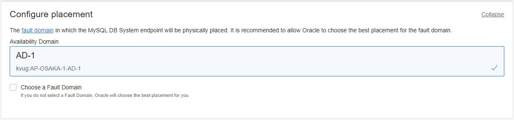  

### Langkah 8
Pada bagian ini Configure hardware Data Storage Size (GB) diisi 50.

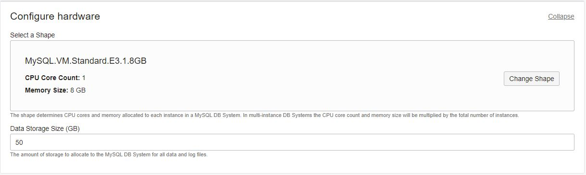

### Langkah 9
Pada bagian Configure Backup Plan lakukan seperti gambar dibawah ini. Lalu klik Create.

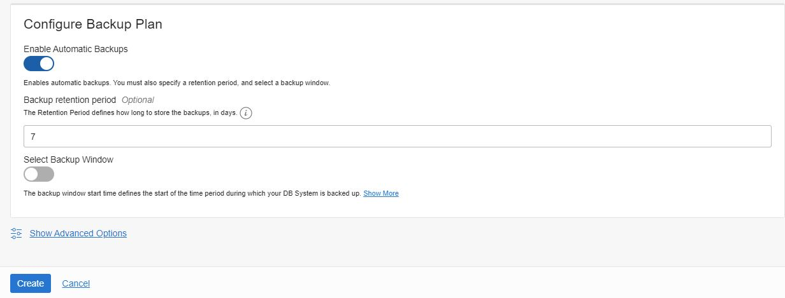

### Langkah 10
Tunggulah Database System hingga status Active.

### Langkah 11
Jika Database System udah Active akan bewarna hijau seperti gambar dibawah ini:

### Langkah 12
Silakan pilih menu di pojok kiri atas, lalu pilih menu Networking > Virtual Cloud Networks

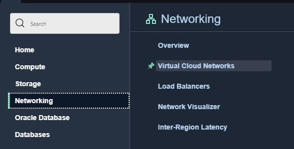

### Langkah 13
Pada bagian ini klik Name Virtual Cloud Networks

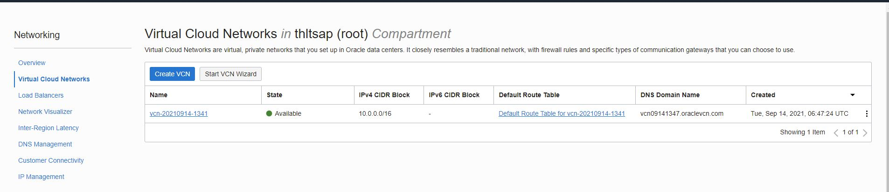

### Langkah 14
Klik pada menu Security Lists

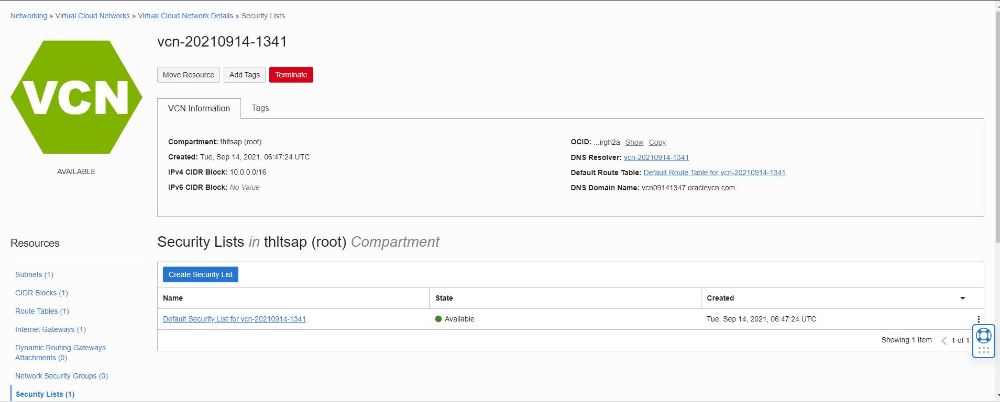

### Langkah 15
Klik pada button Add Ingress Rules

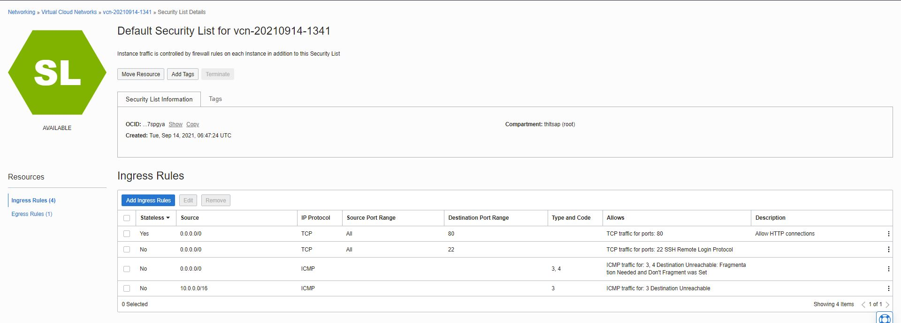

### Langkah 16
Pada bagian Add Ingress Rules isilah Source CIDR dengan 0.0.0.0/0, selanjutnya pada bagian Destination Port Range isilah 3306,33060. Lalu klik button Add Ingress Rules

### Langkah 17
Masukkan ke VCN anda menggunakan PuttY dan ketikkan mysql jika output seperti dibawah ini maka kita harus instalasi mysql terlebih dahulu.

### Langkah 18
Untuk melakukan instalasi mysql dapat mengetikkan code sperti berikut:

sudo apt install mysql-client-core-8.0

### Langkah 19
Lakukan penghubungan VCN dengan Database system yang telah dibuat pada praktikum diatas dengan mengetikkan code seperti ini

mysql -u admin -p -h IpPrivate pada Database System

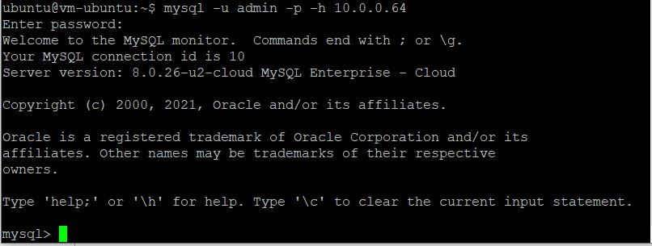

Jika tampilan seperti output ini maka berhasil terhubung.

## Tugas Project Php
Cari aplikasi php yang memiliki database kemudian upload ke server dan buat databasenya.

### Langkah 1
Akses instance dengan PuttY

 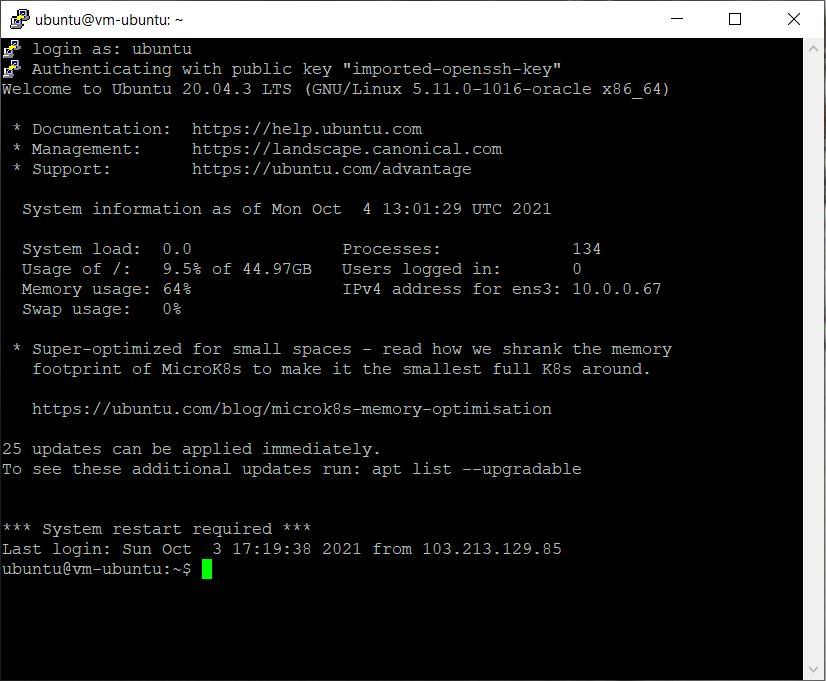

 ### Langkah 2
Lakukan update seperti berikut

sudo apt update

 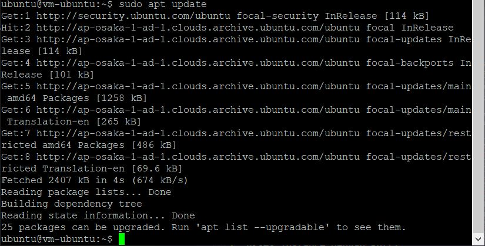

### Langkah 3
Lakukan Install proftpd seperti berikut

sudo apt install proftpd

 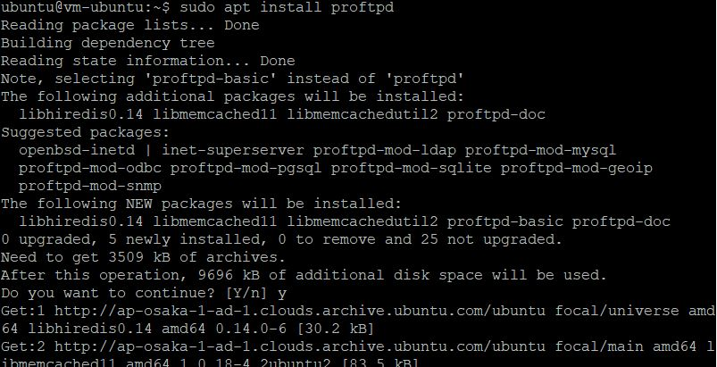

### Langkah 4
Lakukan Install phpmyadmin seperti berikut

sudo apt install phpmyadmin

 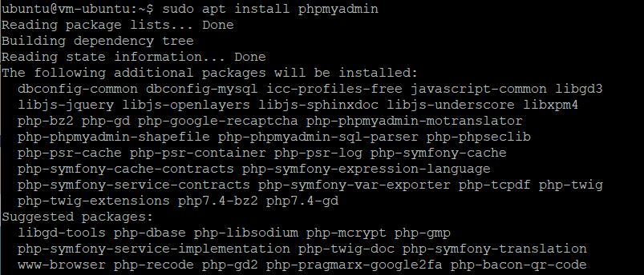  

Nanti akan ada tampilan pilihlah apache2 lalu tekan tab setelah itu enter. pada Pop up selanjutnya pilih lah yang NO. 

### Langkah 5
Lakukan seperti berikut

sudo chmod 777 -R /var/www

 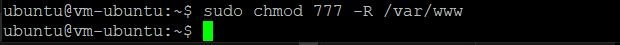

### Langkah 6
Lakukan mengakses mysql untuk membuat database seperti berikut

mysql -u admin -p -h 10.0.0.64

 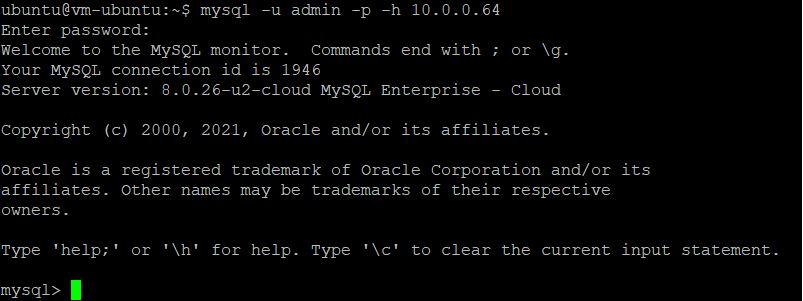

 ### Langkah 7
Membuat Database seperti berikut

CREATE DATABASE school;

dan melakukan grant all:

grant all privileges on school.* to admin;

 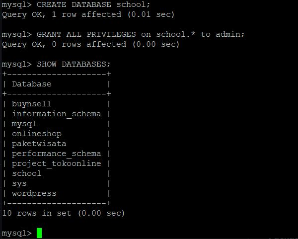 

### Langkah 8
Clone repository project ke direktori /var/www/html seperti berikut

 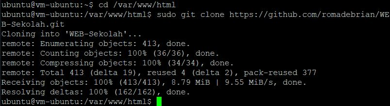

### Langkah 9
Lakukan Use database pada mysql dan Import Database Data Base school.sql seperti berikut:

source /var/www/html/WEB-Sekolah/Data Base school.sql

 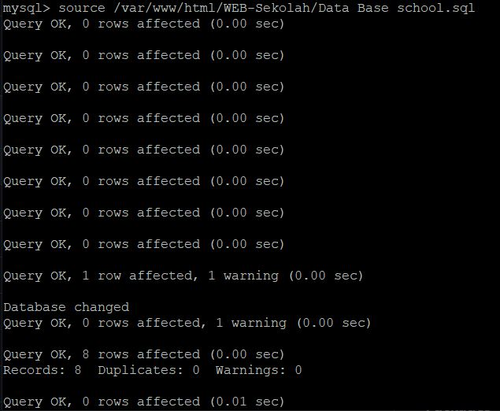

Pastikan database telah berhasil diimport
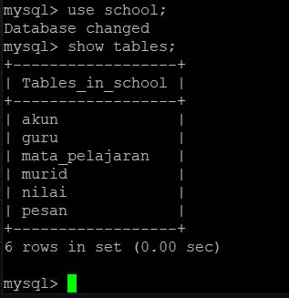

### Langkah 10
Lakukan konfigurasi pada apche2 seperti berikut:

    1. sudo sa2enmod rewrite
    2. sudo systemctl restart apache2    

 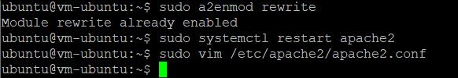

### Langkah 11
Pada file apache2.conf membuat directory baru kemudian di dalamnya diisi 
AllowOverride ALL kemudian keluar dengan perintah :wq seperti berikut.

    1. sudo vim /etc/apache2/apache2.conf    

 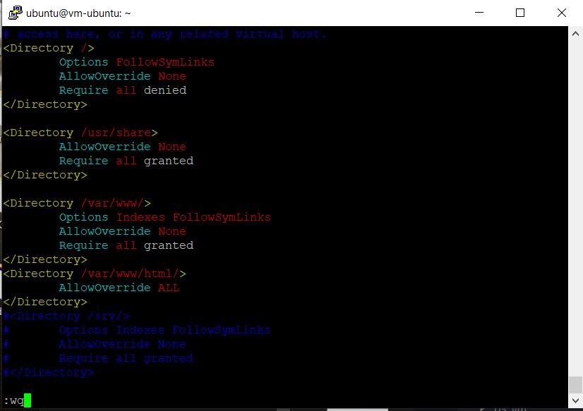 

 ### Langkah 12
Lakukan kembali restart apache2

    1. sudo systemctl restart apache2    

 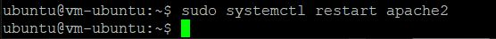 

### Hasil
Tampilan Beranda 

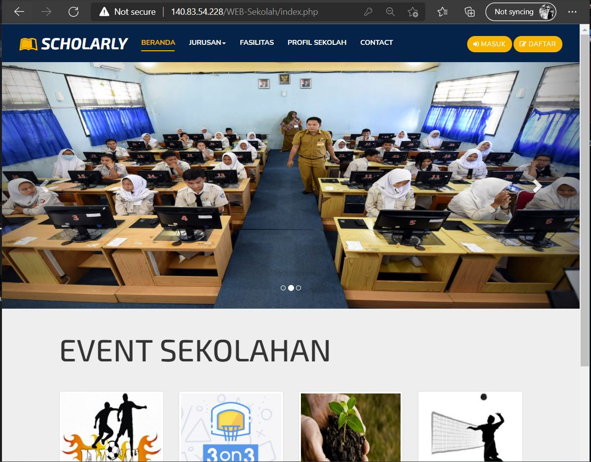

Tampilan Login 

Tampilan Register 

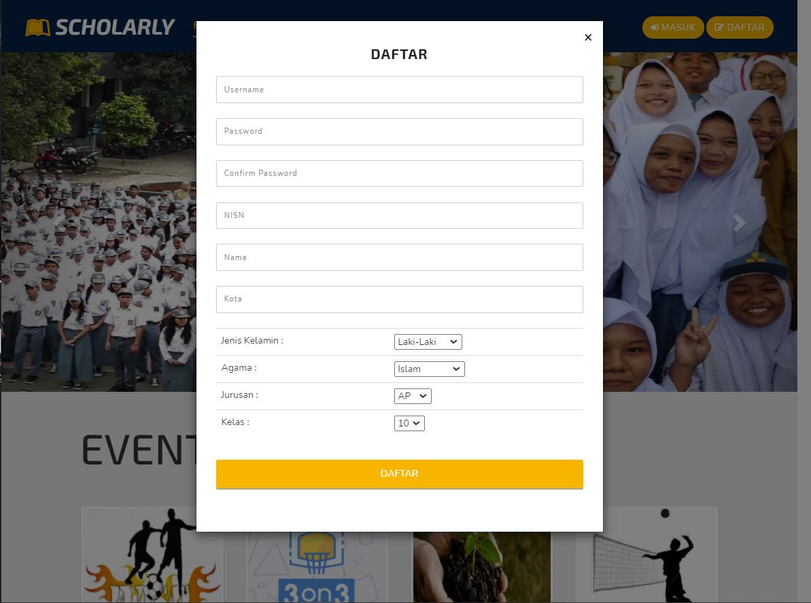

Tampilan Halaman Admin 

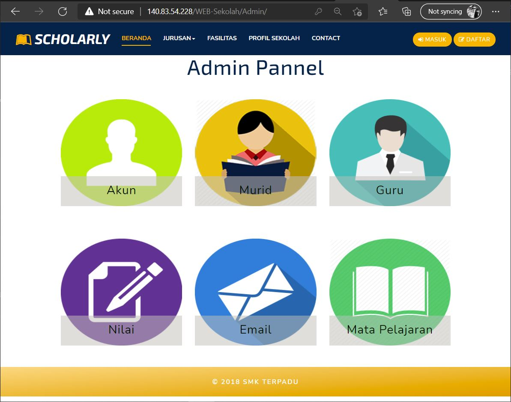

## Project Laravel
### Langkah 1
Akses instance dengan PuttY

 

 ### Langkah 2
 Lalukan Pembuatan password untuk sistem anda code seperti berikut:

    1. sudo passwd

 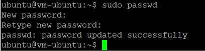

### Langkah 3
 Masuk ke sistem dengan root code sperti berikut:

    1. su

 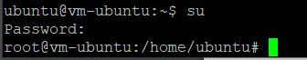 

 Lalu masukan password yang anda telah buat tadi.

### Langkah 4
 Selanjutnya, jalankan perintah berikut untuk meningkatkan semua paket yang diinstal di VPS
Anda:

    1. apt-get update -y

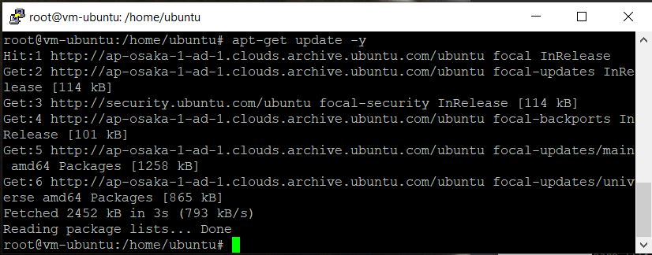

### Langkah 5
 Pertama, instal server web Apache, PHP, dan ekstensi PHP yang diperlukan menggunakan
perintah berikut:

    1. apt-get install apache2 php7.4 libapache2-mod-php7.4 php7.4-curl php-pear php7.4-gd php7.4-dev php7.4-zip php7.4-mbstring php7.4-mysql php7.4-xml curl -y

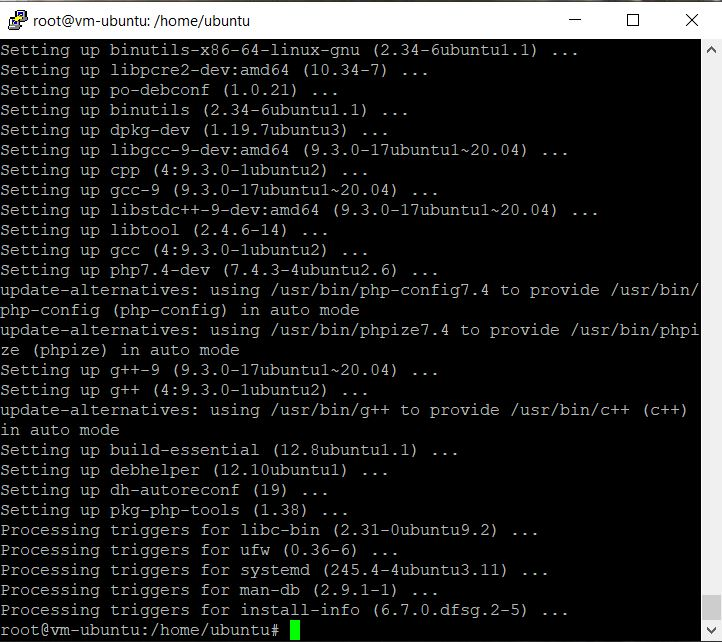

### Langkah 6
 Setelah semua paket diinstal, mulai layanan Apache dan aktifkan untuk memulai setelah
reboot sistem menggunakan perintah berikut:

    1. systemctl start apache2
    2. systemctl enable apache2

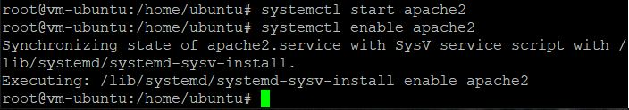

### Langkah 7
 Install composer Anda dapat mengunduh dan menginstal Composer dengan perintah berikut:

    1. curl -sS https://getcomposer.org/installer | php
    2. mv composer.phar /usr/local/bin/composer
    3. chmod +x /usr/local/bin/composer

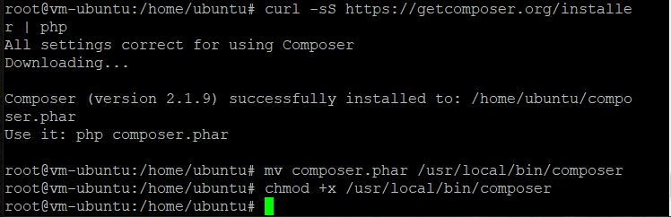

### Langkah 8
 Selanjutnya, verifikasi versi Composer yang diinstal dengan perintah berikut:

    1. composer --version

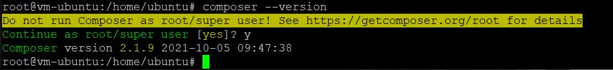

### Langkah 9
 Selanjutnya, masuk mysql dan membuat database nomads dengan perintah berikut:

    1. mysql -u admin -h 10.0.0.64 -p
    2. CREATE DATABASE nomads;

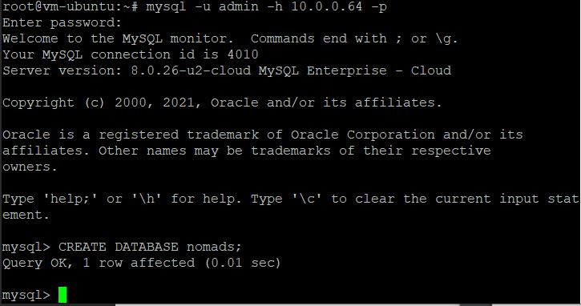

### Langkah 10
 Selanjutnya, masuk mysql dan membuat database nomads dengan perintah berikut:

    1. mysql -u admin -h 10.0.0.64 -p
    2. CREATE DATABASE nomads;

### Langkah 10
 Selanjutnya, clone project git dengan perintah berikut:

    1. git clone https://github.com/thltsap/nomads.git

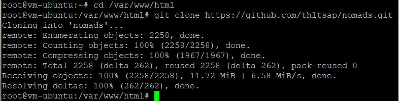

### Langkah 11
 Lakukan ubah akses pada directory aksens dengan menggunakan perintah berikut:

    1. sudo chmod -R 777 nomads

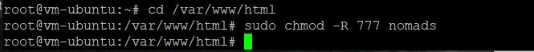

### Langkah 12
 Buat file .env dengan perintah sudo nano .env dan atur databasenya dengan mengubah DB_HOST, DB_DATABASE, DB_USERNAME, DB_PASSWORD seperti
berikut ini:

    1. sudo nano .env    

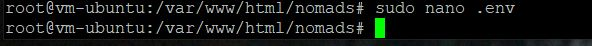
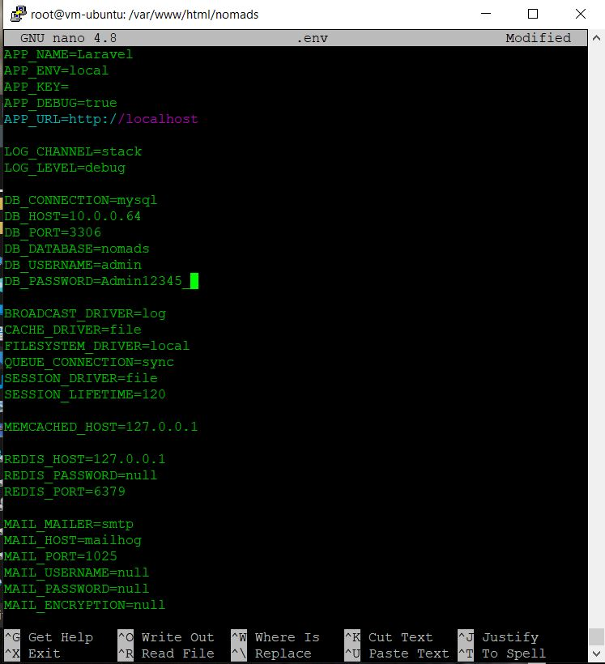

### Langkah 13
 Selanjutnya, lakukan konfigurasi apache2 dengan menggunakan perintah
seperti berikut ini :

    1. sudo nano /etc/apache2/sites-available/nomads.conf

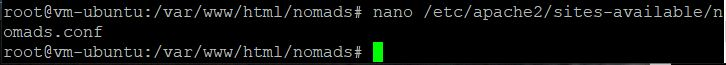

Lalu tambahkan code seperti ini seperti berikut ini:

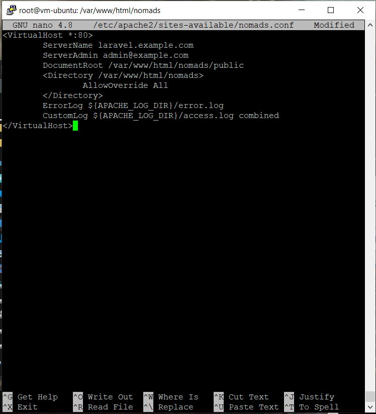

Jika sudah klik tombol ctrl dan x kemudian ketik y untuk menyimpan file
tersebut.

### Langkah 14
 Enable situs dengan:

    1. sudo a2ensite nomads

 Enable URL rewriting dengan:   

    2. sudo a2enmod rewrite  

 Selanjutnya lakukan restart apache2 dengan menggunakan perintah berikut ini

    3. sudo systemctl restart apache2     

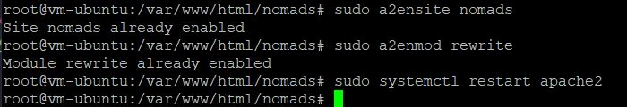

### Langkah 15
 Lalkukan update composer seperti
berikut ini:

    1. composer update    

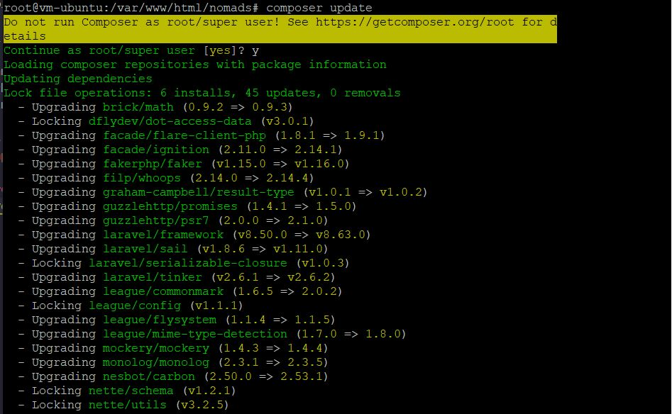

### Langkah 16
 Lalkukan key generate seperti
berikut ini:

    1. php artisan key:generate    

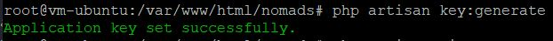

### Langkah 17
 Lalkukan migaration seperti
berikut ini:

    1. php artisan migrate    

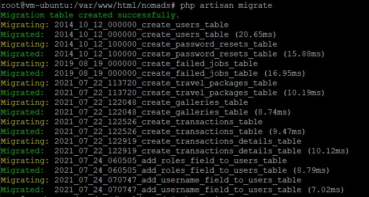

### Langkah 18
 Lalkukan migaration seperti
berikut ini:

    1. php artisan migrate    

### Langkah 19
 Lalkukan storage link seperti
berikut ini:

    1. php artisan storage:link    

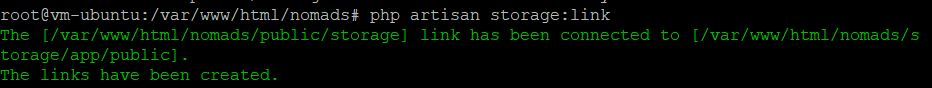

### Langkah 20
Selanjutnya, ubah kepemilikan direktori laravelapp dan berikan izin yang tepat ke direktori
penyimpanan dengan perintah berikut:

    1. chown -R www-data:www-data /var/www/html/nomads
    2. chmod -R 775 /var/www/html/nomads/storage

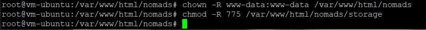

### Langkah 21
 Lalkukan restart apache2 seperti
berikut ini:

    1. sudo systemctl restart apache2   

### Hasil Project
Akses project menggunakan ip public/project/public

    1. Halaman Dashboard

    2. Halaman Register

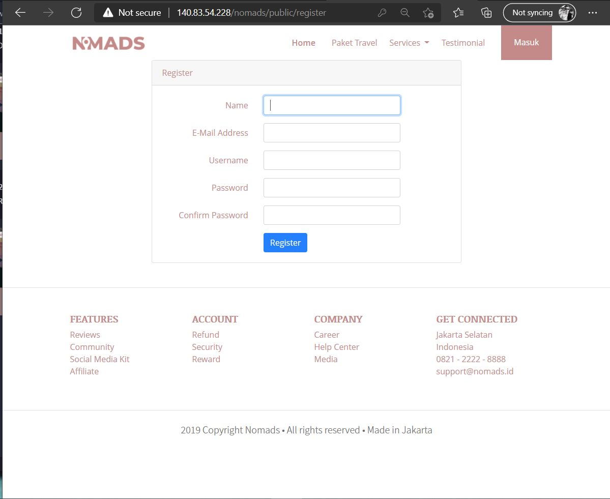

    3. Halaman Login

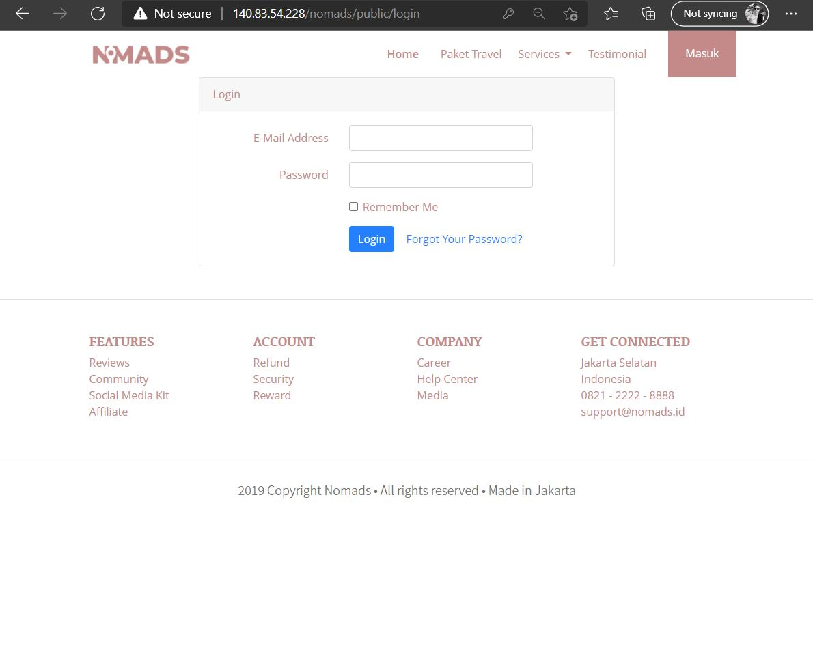

    4. Halaman Dashboard Admin

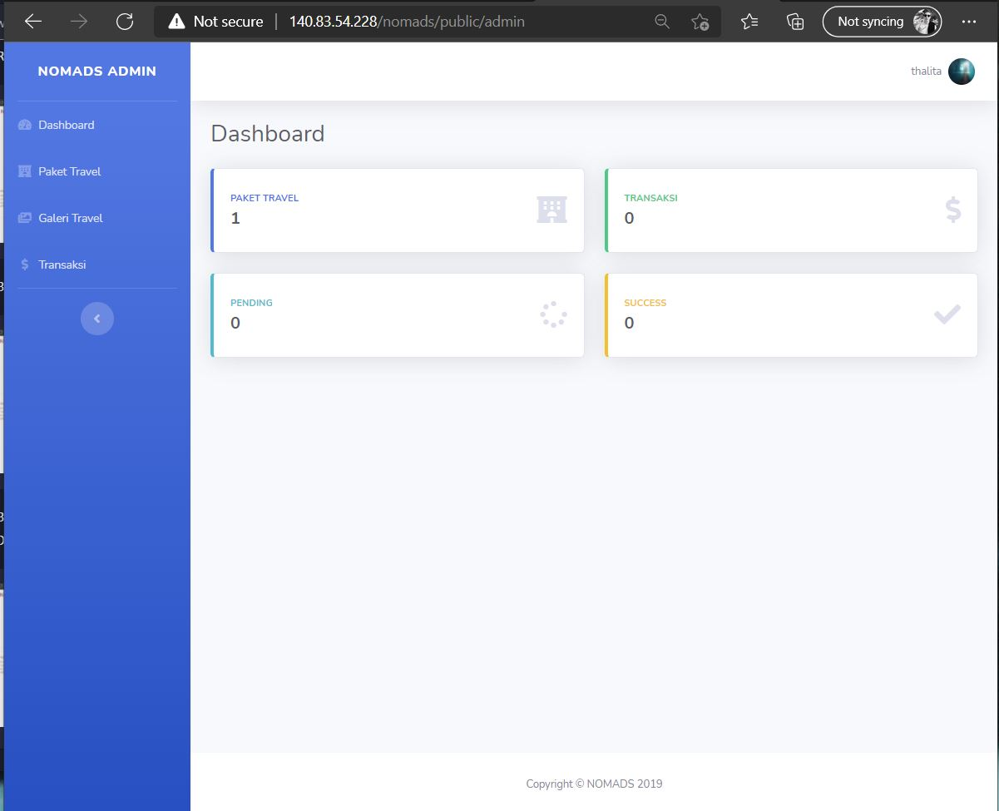

    5. Halaman Dashboard Admin

    6. Halaman Tambah Data Paket Travel

    7. Halaman Paket Travel

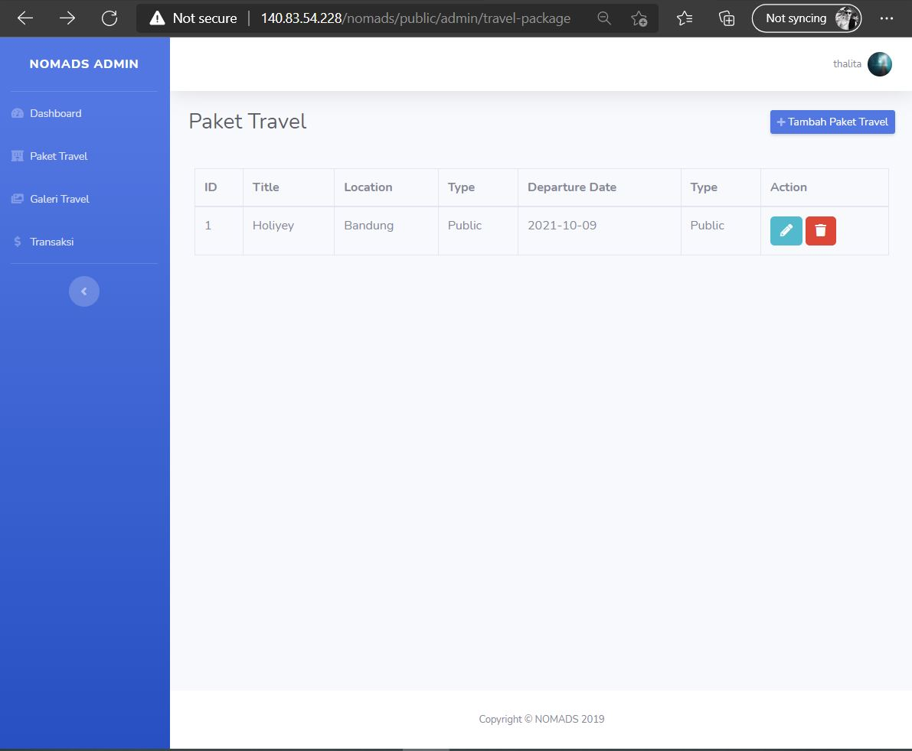

    8. Halaman Tambah Data Gallery

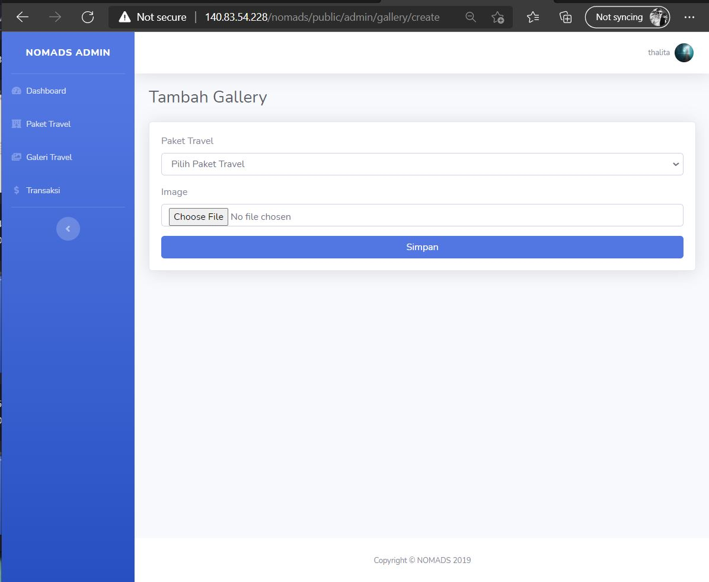

    9. Halaman Dashboard Gallery

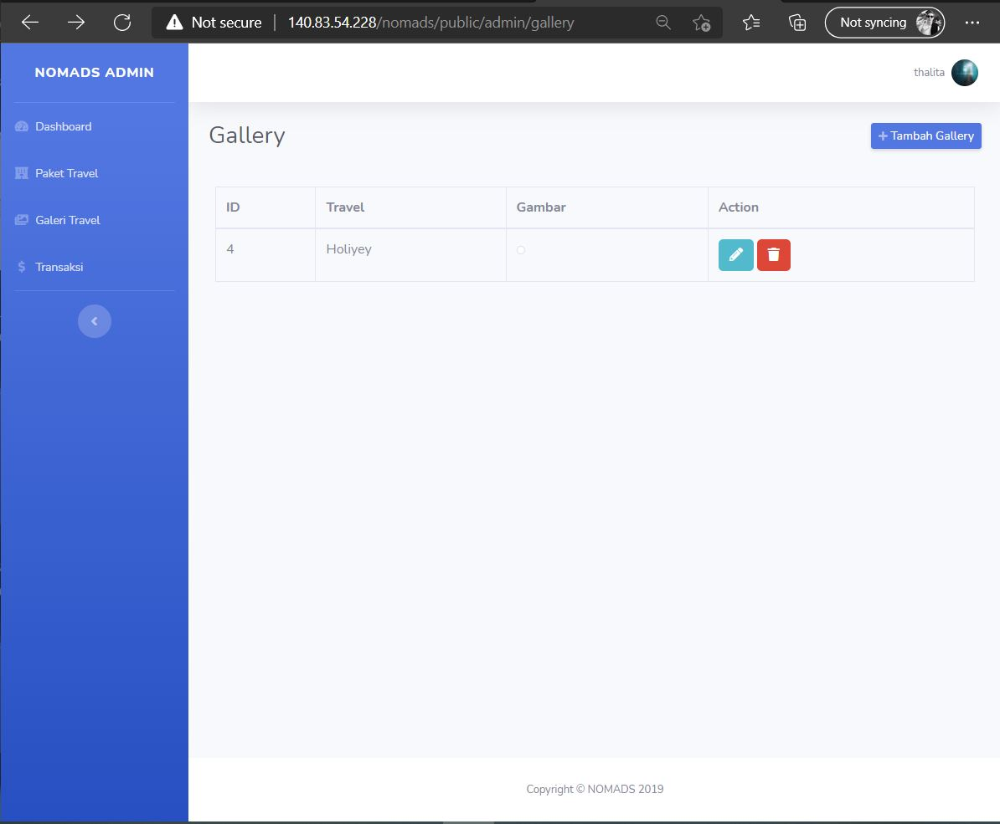

    10. Halaman Dashboard Transaksi

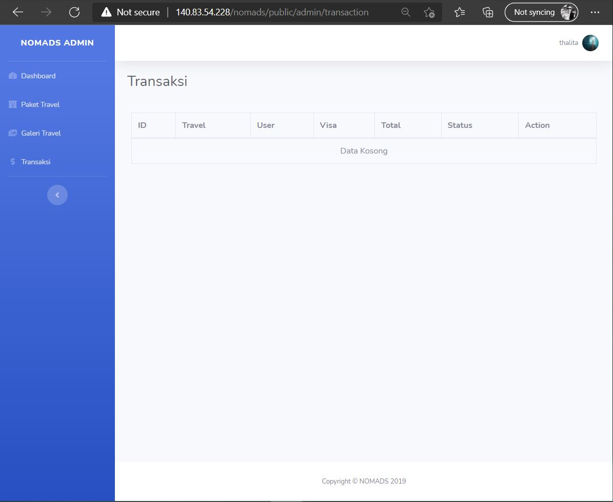

