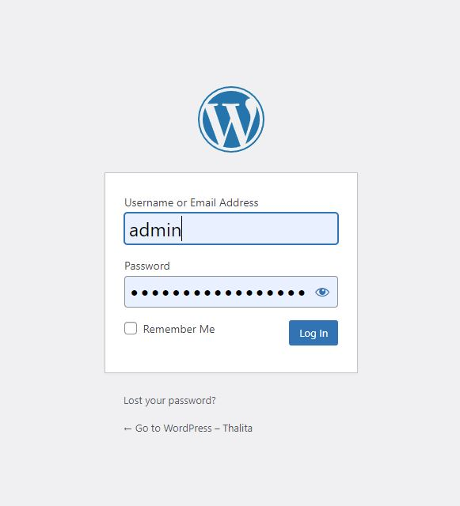

# 05 - Install Wordpress Pada PaaS

## Tujuan Pembelajaran

1. Mengetahui Cara Menginstall Wordpress

### Langkah 1

Akses VM dengan PuttY
 

 

### Langkah 2
 Membuat Database
 
Cara untuk membuat database pada mysql adalah dengan mengetik perintah di bawah ini.Perintah 
pertama untuk membuat database, perintah kedua untuk melihat apakah database kita sudah berhasil 
dibuat dan ketiga adalah memberikan previleges database pada user admin. Anda dapat membuat 
user baru dan mengatur previlegenya.

    1. CREATE DATABASE worpress;
    2. SHOW DATABASES;
    3. GRANT ALL privileges on wordpress.* to admin;

 

### Langkah 3
Download Wordpress Pada Folder /var/www/html dengan perintah:

wget https://wordpress.org/latest.tar.gz;

 

### Langkah 4
Mengetrak Wordpress Pada Folder /var/www/html dengan perintah:

tar zxvf latest.tar.gz

  

### Langkah 5
Selanjutnya setelah estrak file hasil download dapat dihapus dengan menggunakan perintah:

sudo rm rf latest.tar.gz

 

### Langkah 6
Selanjutnya menginstall extension mysql pada php dan mengaktifkannya pada php.ini.
Berikut adalah perintah untuk menginstall extenstion mysql pada php.

sudo apt-get install php-mysql

  

 ### Langkah 7
Menjalankan peritah:

sudo apt install libapache2-mod-php7.4

  

### Langkah 8
Menjalankan peritah:

 sudo apt install php7.4-curl php7.4-gd php7.4-zip

  

### Langkah 9
Masuk ke direktori /etc/php/7.4/apache2 kemudian masuk ke file php.ini dengan 
perintah 

sudo -e /etc/php/7.4/apache2/php.ini

       

### Langkah 10
Kemudian, mengaktifkan extension=php_mysqli.dll, seperti berikut.

 

 ### Langkah 11
Restart apache seperti berikut.

    1. sudo service apache2 restart
    2. sudo chown www-data:www-data -R *

    

### Hasil 1
Jika sudah maka ketika diakses di web browser dengan menggunakan ip public
maka akan tampil seperti berikut ini :

      

### Langkah 12
Selanjutnya konfigurasikan WordPress untuk menggunakan database ini.
Pertama, salin file konfigurasi sampel ke wp-config.php:

  

 ### Langkah 13
Selanjutnya, atur kredensial database di file konfigurasi code:

    1.sudo nano /var/www/html/wordpress/wp-config.php

     

 (jangan ganti
database_name_here atau username_here pada perintah di bawah ini. Ganti
your-password dengan password database Anda.):

         

### Langkah 14
Selanjutnya cari baris berikut :

define( 'AUTH_KEY', 'put your unique phrase here' );

define( 'SECURE_AUTH_KEY', 'put your unique phrase here' );

define( 'LOGGED_IN_KEY', 'put your unique phrase here' );

define( 'NONCE_KEY', 'put your unique phrase here' );

define( 'AUTH_SALT', 'put your unique phrase here' );

define( 'SECURE_AUTH_SALT', 'put your unique phrase here' );

define( 'LOGGED_IN_SALT', 'put your unique phrase here' );

define( 'NONCE_SALT', 'put your unique phrase here' );

Hapus baris tersebut (ctrl+k akan menghapus baris setiap kali Anda menekan
urutan). Kemudian ganti dengan konten
https://api.wordpress.org/secret-key/1.1/salt/. (Alamat ini adalah pengacak yang
mengembalikan kunci yang sepenuhnya acak setiap kali dibuka.) Langkah ini
penting untuk memastikan bahwa situs Anda tidak rentan terhadap serangan
“rahasia yang diketahui”.

  

 Simpan dan tutup file konfigurasi dengan mengetik ctrl+x diikuti dengan y lalu
enter

### Langkah 15
Selanjutnya akses kembali dengan ip public maka tampilan akan berubah. Lalu
isikan form yang ada seperti berikut ini lalu klik button install wordpress.

 

### Langkah 16
Jika sudah lakukan login dengan kredential yang telah dibuat sebelumnya:

 

### Langkah 17
Tampilan Dashboard seperti ini

### Hasil Praktikum
Tampilan Web pertama kita

